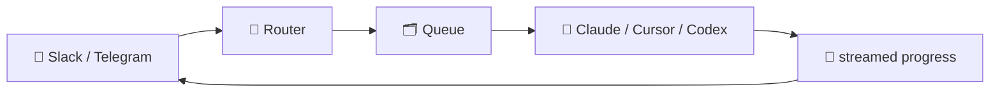

# ⚡ Agent Connect

**Universal middleware between messaging platforms and AI coding agents.**

Mention a bot on Slack or Telegram, pick a project, hand it a task — and watch Claude Code, Cursor, or Codex work in real time, streamed right back into your conversation.

[](LICENSE)
[](https://nodejs.org)
[](https://www.typescriptlang.org/)
[](https://bullmq.io/)
[](#contributing)



Every messaging platform looks the same to the core. Every AI agent looks the same to the core. Adding a new one of either means implementing a single interface — nothing else changes.

> **Status**: this is a from-scratch TypeScript rewrite of the original single-purpose Slack+Claude bot. The architecture, CLI, and docs described here are complete; if you're setting this up fresh, run through [Quick Start](#quick-start) end-to-end in your own environment and open an issue if anything doesn't match what's described.

---

## 📚 Table of Contents

- [✨ Features](#features)
- [📋 Prerequisites](#prerequisites)
- [🚀 Quick Start](#quick-start)
- [🤖 Creating Your Slack App](#creating-your-slack-app)
- [✈️ Creating Your Telegram Bot](#creating-your-telegram-bot)
- [🧠 Setting Up Your Agents](#setting-up-your-agents)
- [⚙️ Environment Variables](#environment-variables)
- [📁 Project Registry](#project-registry)
- [▶️ Running the Application](#running-the-application)
- [💬 Commands](#commands)
- [🔄 Example Walkthrough](#example-walkthrough)
- [🧩 Public API](#public-api)
- [🛠️ CLI Reference](#cli-reference)
- [📊 Queue Dashboard](#queue-dashboard)
- [🏗️ Architecture](#architecture)
- [🔒 Security Notes](#security-notes)
- [📝 License](#license)
- [🤝 Contributing](#contributing)

---

<a id="features"></a>

## ✨ Features

- 🗂️ **Multi-project support** — register any number of local repos, switch between them per-user with `use <project>`
- 🤖 **Multi-agent** — Claude Code, Cursor, and Codex can all be registered at once; each user picks their active one with `agent <name>`
- 🌐 **Multi-platform** — Slack and Telegram today, behind the same `MessagingAdapter` interface WhatsApp/Discord/Teams/etc. would use
- 📡 **Live streaming** — progress streams into a single, continuously-updated message — no spam
- 🚦 **Queued & serialized** — one execution per user at a time; extra prompts queue up automatically via BullMQ (or in-memory for local dev)
- ⛔ **Cancellable** — stop a running execution (and clear anything queued) with a single command
- 🧩 **Plugin system** — hook `beforeMessage`/`afterMessage`/`beforeExecution`/`afterExecution`/`beforeReply`/`afterReply` and register new commands, without touching core
- 🔒 **Safe by construction** — projects are an exact allowlist (no path traversal), every agent CLI is `spawn`ed with an argv array (never a shell string), executions are timeout-bounded
- 🛠️ **CLI** — `npx @capsbharg/agent-connect init` scaffolds `.env`/`projects.json`/an example app; `npx @capsbharg/agent-connect doctor` verifies your setup

---

<a id="prerequisites"></a>

## 📋 Prerequisites

Before you start, make sure you have:

1. **Node.js `24.18.0`** — check with `node --version`. ([nodejs.org](https://nodejs.org))
2. **At least one AI agent CLI**, installed and authenticated:
   - [Claude Code](https://docs.claude.com/en/docs/claude-code/overview) — `npm install -g @anthropic-ai/claude-code`, then `claude` once to log in. Enabled by default.
   - [Cursor CLI](https://cursor.com/docs/cli) (`cursor-agent`) — optional, needs a `CURSOR_API_KEY`.
   - [OpenAI Codex CLI](https://developers.openai.com/codex) (`codex`) — optional.
3. **Redis 5.0+**, for production use — powers the BullMQ execution queue and per-user session storage. Optional for local dev/evaluation (an in-memory fallback is used automatically when `REDIS_URL` is unset — single process only, not for production). Any Redis-compatible server works ([Redis](https://redis.io/), [Memurai](https://www.memurai.com/) on Windows, etc.)
4. **Credentials for at least one messaging platform** — a Slack app ([walkthrough below](#creating-your-slack-app)) and/or a Telegram bot ([walkthrough below](#creating-your-telegram-bot)). You can enable both at once.

---

<a id="quick-start"></a>

## 🚀 Quick Start

**Step 1 — clone and install:**

```bash
git clone <this-repo-url> agent-connect
cd agent-connect
npm install
npm run build
```

**Step 2 — copy the config templates:**

```bash
cp .env.example .env
cp projects.example.json projects.json
```

**Step 3 — get your credentials.** Follow [Creating Your Slack App](#creating-your-slack-app) and/or [Creating Your Telegram Bot](#creating-your-telegram-bot) below, then paste the tokens into `.env`.

**Step 4 — register a project.** Edit `projects.json` to map a name to an absolute path on your machine (see [Project Registry](#project-registry)):

```json
{ "my-app": "/absolute/path/to/my-app" }
```

**Step 5 — verify your setup:**

```bash
npx @capsbharg/agent-connect doctor
```

This checks that your agent CLI(s) are on `PATH`, Redis is reachable (if configured), and your Slack/Telegram tokens are valid — fix anything it flags before continuing.

**Step 6 — run it.** Either use the bundled example app:

```bash
cd examples/slack-claude-minimal
npm install
npm start
```

...or generate your own entrypoint from scratch:

```bash
npx @capsbharg/agent-connect init   # interactively (re)writes .env/projects.json/an example app, then runs doctor
node your-entrypoint.mjs
```

**Step 7 — try it.** In Slack or Telegram, message the bot: `use my-app`, then give it a task (see [Example Walkthrough](#example-walkthrough)).

---

<a id="creating-your-slack-app"></a>

## 🤖 Creating Your Slack App

You'll need a Slack app with **Socket Mode** enabled, three **bot token scopes**, and two **event subscriptions**.

### 1️⃣ Create the app

Go to [api.slack.com/apps](https://api.slack.com/apps) → **Create New App** → **From scratch** → name it (e.g. `Agent Connect`) and pick your workspace.

### 2️⃣ Turn on Socket Mode

- Sidebar → **Socket Mode** → toggle **on**.
- Generate an **App-Level Token** with the scope `connections:write` (lets the bot open a Socket Mode connection).
- Copy the token (starts with `xapp-`) → this is `SLACK_APP_TOKEN`.

### 3️⃣ Add Bot Token Scopes

**Features → OAuth & Permissions → Scopes → Bot Token Scopes** → add:

| Scope | Why |
| --- | --- |
| `app_mentions:read` | See messages that `@mention` the bot |
| `chat:write` | Post and edit messages (how streaming progress works) |
| `im:history` | Receive DMs sent directly to the bot |

<details>
<summary>Optional: respond to plain messages in channels (not just mentions)</summary>

Add `channels:history` (public channels), `groups:history` (private channels), and/or `mpim:history` (group DMs), and subscribe to the matching event(s) below (`message.channels`, `message.groups`, `message.mpim`). ⚠️ Noisy — every message becomes a potential command/prompt.
</details>

### 4️⃣ Subscribe to Events

**Features → Event Subscriptions** → enable → **Subscribe to bot events** → add `app_mention` and `message.im` → **Save Changes**.

### 5️⃣ Install the app

**OAuth & Permissions** → **Install to Workspace** (or **Reinstall** if you added scopes after an earlier install) → **Allow**.

### 6️⃣ Collect your credentials

| Value | Where to find it | Goes in |
| --- | --- | --- |
| Bot User OAuth Token (`xoxb-...`) | OAuth & Permissions → top of page | `SLACK_BOT_TOKEN` |
| Signing Secret | Basic Information → App Credentials | `SLACK_SIGNING_SECRET` |
| App-Level Token (`xapp-...`) | From step 2 | `SLACK_APP_TOKEN` |

### 7️⃣ Say hello 👋

`/invite @your-bot-name` in a channel, or just DM it directly — no invite needed for that.

---

<a id="creating-your-telegram-bot"></a>

## ✈️ Creating Your Telegram Bot

### 1️⃣ Talk to BotFather

Open [@BotFather](https://t.me/BotFather) in Telegram → `/newbot` → follow the prompts (name, then a unique username ending in `bot`).

### 2️⃣ Copy the token

BotFather replies with a token like `123456789:AAExampleTokenHere`. That's your `TELEGRAM_BOT_TOKEN`.

### 3️⃣ (Optional) tune group behavior

By default, Telegram's **group privacy mode** means the bot only sees, in groups: commands (`/help`), replies to its own messages, and `@mentions` of it — DMs are unaffected. To have it read every group message instead, message BotFather with `/setprivacy` → select your bot → **Disable**. Most setups should leave this on default (**Enabled**).

### 4️⃣ Say hello 👋

Search for your bot's username in Telegram and start a private chat, or add it to a group.

---

<a id="setting-up-your-agents"></a>

## 🧠 Setting Up Your Agents

At least one agent must be enabled. You can enable more than one — each user picks their active one with `agent <name>`.

### Claude Code (enabled by default)

```bash
npm install -g @anthropic-ai/claude-code
claude   # run once interactively to authenticate
```
`.env`: `CLAUDE_ENABLED=true` (default), `CLAUDE_CLI_PATH=claude` (default, or an absolute path).

### Cursor CLI (optional)

Install per [Cursor's CLI docs](https://cursor.com/docs/cli), then set in `.env`:
```
CURSOR_ENABLED=true
CURSOR_API_KEY=your-cursor-api-key
```

### OpenAI Codex CLI (optional)

Install per [OpenAI's Codex CLI docs](https://developers.openai.com/codex), then set in `.env`:
```
CODEX_ENABLED=true
```

Run `npx @capsbharg/agent-connect doctor` after any of the above to confirm the CLI is found on `PATH` and responds to `--version`.

---

<a id="environment-variables"></a>

## ⚙️ Environment Variables

The full, current list — with defaults and descriptions — lives in [`.env.example`](.env.example). Highlights:

| Variable | Description |
| --- | --- |
| `REDIS_URL` | Redis connection string; unset falls back to in-memory storage/queue (dev only) |
| `PROJECTS_CONFIG_PATH` | Path to the project registry JSON file (default `./projects.json`) |
| `DEFAULT_AGENT` | Which registered agent handles a user's prompts until they run `agent <name>` |
| `AGENT_WORKER_CONCURRENCY` | Max executions processed concurrently across all users (default `4`) |
| `SLACK_BOT_TOKEN` / `SLACK_SIGNING_SECRET` / `SLACK_APP_TOKEN` | Enable the Slack adapter |
| `TELEGRAM_BOT_TOKEN` | Enable the Telegram adapter |
| `CLAUDE_ENABLED` / `CURSOR_ENABLED` / `CODEX_ENABLED` | Enable each agent (Claude is on by default) |
| `ALLOWED_USERS` / `ALLOWED_CHANNELS` / `ALLOWED_GROUPS` | Security allowlists (comma-separated; empty = unrestricted) |
| `ADMIN_ENABLED` / `ADMIN_PORT` | Optional queue dashboard (default on, port `3000`) |

🔐 Never commit `.env` — it's already excluded via `.gitignore`.

---

<a id="project-registry"></a>

## 📁 Project Registry

An agent only ever runs inside a project directory you've explicitly registered — **never** an arbitrary path. Map project names to absolute local paths in `projects.json`:

```json
{
  "backend-api": "/path/to/your/backend-api",
  "frontend-web": "/path/to/your/frontend-web"
}
```

`projects.json` is gitignored (it contains your local filesystem layout). Entries whose path doesn't exist are skipped at startup with a logged warning. `use <project>` matches names **exactly** against a key in this file — user input is never concatenated into a filesystem path, so there's no path-traversal risk from the project name itself.

---

<a id="running-the-application"></a>

## ▶️ Running the Application

For the bundled example (Slack + Claude):

```bash
cd examples/slack-claude-minimal
npm install
npm start
```

For your own entrypoint (`AgentConnect.fromEnv()` or explicit DI — see [Public API](#public-api)):

```bash
node your-entrypoint.mjs
```

On success you'll see log lines like:

```
[INFO] Slack adapter connected (Socket Mode)
[INFO] Telegram adapter connected (long polling)
[INFO] Queue dashboard: http://127.0.0.1:3000/admin/queues
[INFO] AgentConnect started
```

Stop it with `Ctrl+C` (`SIGINT`) — the example entrypoint handles graceful shutdown.

---

<a id="commands"></a>

## 💬 Commands

Send these as a Slack mention/DM, or a Telegram message/`/command`. Anything else is treated as a prompt and sent to your active agent.

| Command | Description |
| --- | --- |
| 🆘 `help` | List available commands |
| 📂 `projects` | List projects available in the registry |
| 📍 `current` | Show your currently active project |
| 🔀 `use <project>` | Switch your active project |
| 🤖 `agents` | List registered agents |
| 🔁 `agent [name]` | Show or switch which agent handles your prompts |
| 📊 `status` | Show your running/queued executions |
| ⛔ `cancel` | Stop your running execution and clear your queued ones |
| 🧹 `clear` | Clear your active project selection |

Each user's active project/agent is stored independently and survives a restart. A prompt sent with no active project gets a reminder to run `use <project>` first. Plugins can register additional commands — see [docs/plugin-guide.md](docs/plugin-guide.md).

---

<a id="example-walkthrough"></a>

## 🔄 Example Walkthrough

```
@your-bot-name use backend-api
@your-bot-name Implement JWT authentication
```

The bot immediately acknowledges the request, then picks it up from the queue, runs your active agent inside `backend-api`'s directory, and streams progress into a single, continuously-updated message:

```
🤖 Working on: Implement JWT authentication

Reading `src/auth.js`...
Editing `src/middleware/jwt.js`...
Running `npm test`...

✅ Done.
...
```

Only one execution runs per user at a time — additional prompts from the same user queue up and run in order. `status` shows what's running/queued; `cancel` stops the current run and clears anything still queued. Want a different agent for this task? `agent cursor` (or `codex`) switches it before your next prompt.

---

<a id="public-api"></a>

## 🧩 Public API

```js
import { AgentConnect, SlackAdapter, TelegramAdapter, ClaudeAgent, CursorAgent, CodexAgent } from '@capsbharg/agent-connect';

const app = new AgentConnect({
  messaging: [new SlackAdapter(), new TelegramAdapter()],
  agents: [new ClaudeAgent(), new CursorAgent(), new CodexAgent()],
});

await app.start();
```

Or let it configure itself entirely from `.env`:

```js
import { AgentConnect } from '@capsbharg/agent-connect';

const app = AgentConnect.fromEnv();
await app.start();
```

See [docs/developer-guide.md](docs/developer-guide.md) for the full options reference and [docs/api-reference.md](docs/api-reference.md) for the complete public surface.

---

<a id="cli-reference"></a>

## 🛠️ CLI Reference

| Command | What it does |
| --- | --- |
| `npx @capsbharg/agent-connect init` | Interactively writes `.env`, `projects.json`, and an example entrypoint into the current directory, then runs `doctor` |
| `npx @capsbharg/agent-connect doctor` | Checks agent CLIs are on `PATH` (`--version`), pings Redis if configured, and validates Slack (`auth.test`)/Telegram (`getMe`) tokens |
| `npx @capsbharg/agent-connect --help` | Show usage |

---

<a id="queue-dashboard"></a>

## 📊 Queue Dashboard

With `ADMIN_ENABLED=true` (the default) and a Redis-backed queue, starting the app also starts a [Bull Board](https://github.com/felixmosh/bull-board) dashboard at:

```
http://127.0.0.1:3000/admin/queues
```

(using `ADMIN_PORT`), showing the execution queue's waiting/active/completed/failed/delayed jobs. It's bound to `127.0.0.1` only (no auth of its own) and should never be exposed beyond localhost. Set `ADMIN_ENABLED=false` to disable it. Only available when a Redis-backed queue is in use (not the in-memory fallback).

---

<a id="architecture"></a>

## 🏗️ Architecture

Clean Architecture, SOLID, dependency injection, adapter pattern — every messaging platform and every AI agent is a swappable implementation of a small interface. See [docs/architecture.md](docs/architecture.md) for the full flow diagram and module map, [docs/plugin-guide.md](docs/plugin-guide.md) for extending it without touching core, and [docs/migration-guide.md](docs/migration-guide.md) if you're coming from the original Slack-only bot.

---

<a id="security-notes"></a>

## 🔒 Security Notes

- `projects.json` and `.env` are both gitignored — they hold your real local paths and platform credentials respectively. Never commit them or paste their contents into an issue/PR.
- Only entries in your own `projects.json` are ever reachable; `use <project>` matches project names as an exact allowlist lookup, never as a filesystem path built from user input.
- Every agent CLI is always launched via `spawn` with an argv array — never a shell string — so prompts can never be interpreted as shell commands.
- The admin dashboard (`/admin/queues`) is bound to `127.0.0.1` and has no authentication of its own — don't expose it beyond localhost.
- Use `ALLOWED_USERS`/`ALLOWED_CHANNELS`/`ALLOWED_GROUPS` to restrict who can reach the bot at all once you're beyond solo/local use.

---

<a id="license"></a>

## 📝 License

[MIT](LICENSE) — free to use, modify, and distribute.

---

<a id="contributing"></a>

## 🤝 Contributing

Issues and PRs welcome! Adding a new messaging platform or AI agent should only ever require implementing `MessagingAdapter` or `AgentAdapter` (see `src/interfaces/`) — if a contribution needs to touch `core/router`, `core/execution`, or `core/commands` to add a platform/agent, something's off with the abstraction.
