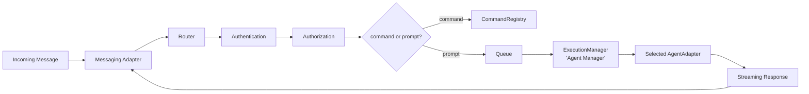

# Architecture

## Vision

Agent Connect is middleware: any messaging platform on one side, any AI coding agent on the other, talking through the same core. The core never knows which platform sent a message or which agent is answering it — it only knows the seven interfaces below.

## High-level flow



1. A `MessagingAdapter` (Slack, Telegram, ...) turns a platform-native event into an `InboundMessage` and calls the handler the `Router` registered.
2. `Router` emits `beforeMessage`, resolves an `Identity` via `AuthenticationProvider`, checks `AuthorizationProvider`, then either routes to a `CommandRegistry` entry (`help`, `projects`, `use`, `current`, `agents`, `agent`, `status`, `cancel`, `health`, `clear`, plus anything a plugin registered) or — for a free-form prompt — requires an active project (`ProjectSession`), enforces `MAX_QUEUED_PER_IDENTITY` against that identity's running+queued executions, builds an `ExecutionJobPayload`, and enqueues it via `QueueProvider`.
3. `ExecutionManager` is the queue's processor (the "Agent Manager" in the spec): per-identity serialized (`PerIdentityMutex`), it resolves the user's active `AgentAdapter` via `AgentRegistry`, creates a fresh `StreamingResponder` for the conversation, runs the agent, and streams progress into that responder — emitting `beforeExecution`/`afterExecution`/`beforeReply`/`afterReply` along the way.
4. The `StreamingResponder` (created by the same `MessagingAdapter` that received the message) hides "Slack edits a thread message" vs "Telegram edits a chat message" behind `post()` / `update()` / `complete()`.

## The seven interfaces (`src/interfaces/`)

| Interface                | Job                                                                                          | Built-in implementations                                           |
| ------------------------ | -------------------------------------------------------------------------------------------- | ------------------------------------------------------------------ |
| `MessagingAdapter`       | Receive messages, create a `StreamingResponder`                                              | `SlackAdapter`, `TelegramAdapter`                                  |
| `AgentAdapter`           | Execute a prompt, stream progress, support cancel/health-check                               | `ClaudeAgent`, `CursorAgent`, `CodexAgent`, `GeminiAgent`          |
| `QueueProvider`          | Enqueue/process/cancel executions                                                            | `BullMQQueueProvider` (Redis), `InMemoryQueueProvider` (dev/tests) |
| `StorageProvider`        | JSON key-value store for sessions                                                            | `RedisStorageProvider`, `InMemoryStorageProvider`                  |
| `AuthenticationProvider` | Resolve an `Identity` from an `InboundMessage`                                               | `PassthroughAuthenticationProvider`                                |
| `AuthorizationProvider`  | Allow/deny an already-authenticated `Identity`                                               | `AllowListAuthorizationProvider`                                   |
| `EventPublisher`         | `beforeMessage`/`afterMessage`/`beforeExecution`/`afterExecution`/`beforeReply`/`afterReply` | `EventBus`                                                         |

No concrete adapter/agent/provider is ever imported by `core/router`, `core/execution`, or `core/commands` — only these interfaces. `core/AgentConnect.ts` is the one composition root allowed to import concrete classes directly, so it can wire whichever ones you pass it.

## Module map

```
core/
  AgentConnect.ts     composition root: constructor(options) + static fromEnv()
  config/             zod schema, env loader, ResolvedConfig
  logger/             Logger interface + pino implementation
  events/             EventBus + the EventMap type
  auth/, authz/       AuthenticationProvider / AuthorizationProvider defaults
  storage/, queue/    StorageProvider / QueueProvider implementations
  project/            ProjectRegistry (exact-allowlist) + ProjectSession (per-user active project)
  agentRegistry/      AgentAdapter registry + per-user active-agent selection
  commands/           CommandParser (pure) + CommandRegistry (open, plugin-extensible) + built-ins
  router/              Router — the pipeline above
  execution/            ExecutionManager, ActiveExecutionRegistry, PerIdentityMutex
  plugins/              Plugin/PluginManager + the AuditLogPlugin reference plugin
  admin/                optional Bull Board dashboard (BullMQQueueProvider only)
interfaces/           the seven contracts (barrel export)
messaging/slack/      SlackAdapter, SlackApp (Bolt factory), SlackThreadStream
messaging/telegram/   TelegramAdapter, TelegramMessageStream
agents/shared/        CliProcessRunner (spawn/stream/timeout/cancel for any CLI agent), ndjson parsing
agents/claude/        ClaudeAgent + ClaudeStreamParser
agents/cursor/        CursorAgent + CursorStreamParser
agents/codex/         CodexAgent + CodexStreamParser
agents/gemini/        GeminiAgent + GeminiStreamParser
cli/                  `agent-connect init` / `agent-connect doctor`
```

## Extension points (design only — not implemented)

Adding a new messaging platform or agent means implementing exactly one interface (`MessagingAdapter` or `AgentAdapter`) — nothing in `core/` changes.

| Category  | Planned, not implemented                                                                                                    |
| --------- | --------------------------------------------------------------------------------------------------------------------------- |
| Messaging | WhatsApp, Discord, Microsoft Teams, Signal, Email, GitHub Issues, GitLab Issues, Web Chat                                   |
| Agents    | OpenHands, Amazon Q, CodeRabbit, custom agents                                                                              |
| Plugins   | GitHub, GitLab, Jira (see [plugin-guide.md](./plugin-guide.md) — `AuditLogPlugin` is the one real reference implementation) |

## Security

- Project selection is an **exact-key allowlist** (`ProjectRegistry`) — a project name is never concatenated or joined into a filesystem path.
- Every CLI-based agent spawns via `cross-spawn` with an **argv array**, never a shell string.
- `ClaudeAgent`/`CursorAgent`/`GeminiAgent` run headless by default (`--dangerously-skip-permissions` / `--force` / `--yolo`, gated by `CLAUDE_SKIP_PERMISSIONS`/`CURSOR_FORCE`/`GEMINI_YOLO`) — no per-action confirmation, so `AllowListAuthorizationProvider` is the actual access boundary, not the agent CLI itself. `AgentConnect.start()` logs a loud warning when `ALLOWED_USERS`/`ALLOWED_CHANNELS`/`ALLOWED_GROUPS` are all empty.
- Config is validated with `zod` and fails fast with a clear error (`core/config/loadFromEnv.ts`).
- `AllowListAuthorizationProvider` enforces `ALLOWED_USERS` / `ALLOWED_CHANNELS` / `ALLOWED_GROUPS`.
- `MAX_QUEUED_PER_IDENTITY` bounds how many executions (running + queued) a single identity may have outstanding, enforced in `Router` before a prompt is enqueued.
- `RedisStorageProvider`/`BullMQQueueProvider` accept a `REDIS_KEY_PREFIX` to namespace their keys when Redis is shared with other apps.
- The optional queue dashboard binds to `127.0.0.1` only and has no authentication of its own.
- `beforeExecution`/`afterExecution` events plus the `AuditLogPlugin` give you a structured audit trail.
- Every `AgentAdapter.healthCheck()` runs automatically (non-blocking) on `AgentConnect.start()`, is reused by `agent-connect doctor`, and is exposed as the `health` chat command — the same health signal everywhere.
